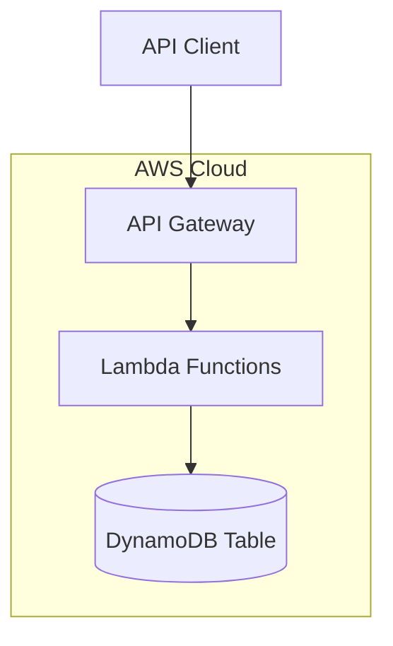

# Design Document: Engineering Task API

## Overview

The Engineering Task API is a serverless REST API built on AWS infrastructure that provides task management capabilities for engineering teams. The system follows a serverless architecture pattern using AWS Lambda for compute, API Gateway for HTTP routing, and DynamoDB for data persistence with a single-table design.

The API exposes five primary endpoints corresponding to CRUD operations plus list/filter functionality. All endpoints return JSON responses and follow RESTful conventions. The system is designed for scalability, cost-efficiency, and low operational overhead through serverless components.

## Architecture

### High-Level Architecture



### Component Overview

1. **API Gateway**: HTTP endpoint routing and request/response transformation
2. **Lambda Functions**: Business logic execution for each API operation
3. **DynamoDB**: NoSQL data store with single-table design
4. **Terraform**: Infrastructure as Code for provisioning and management

### Deployment Model

- Runtime: Node.js 20
- Region: Single region deployment (configurable)
- Scaling: Automatic via Lambda and DynamoDB on-demand capacity
- Authentication: Not specified in requirements (future enhancement)

## Components and Interfaces

### API Endpoints

#### 1. Create Task
- **Method**: POST
- **Path**: `/tasks`
- **Request Body**:
```json
{
  "description": "string (required)",
  "assignee": "string (optional)",
  "priority": "P0|P1|P2|P3|P4 (optional, default: P2)",
  "status": "open|in-progress|blocked|done (optional, default: open)",
  "dueDate": "ISO 8601 date string (optional)"
}
```
- **Success Response**: 201 Created
```json
{
  "id": "string",
  "description": "string",
  "assignee": "string|null",
  "priority": "string",
  "status": "string",
  "dueDate": "string|null",
  "createdAt": "ISO 8601 timestamp",
  "updatedAt": "ISO 8601 timestamp"
}
```
- **Error Responses**: 400 Bad Request, 503 Service Unavailable

#### 2. Get Task
- **Method**: GET
- **Path**: `/tasks/{id}`
- **Path Parameters**: `id` - Task identifier
- **Success Response**: 200 OK (same structure as Create response)
- **Error Responses**: 404 Not Found

#### 3. Update Task
- **Method**: PUT
- **Path**: `/tasks/{id}`
- **Path Parameters**: `id` - Task identifier
- **Request Body**: Same as Create (all fields optional except at least one must be provided)
- **Success Response**: 200 OK (same structure as Create response)
- **Error Responses**: 400 Bad Request, 404 Not Found, 503 Service Unavailable

#### 4. Delete Task
- **Method**: DELETE
- **Path**: `/tasks/{id}`
- **Path Parameters**: `id` - Task identifier
- **Success Response**: 204 No Content
- **Error Responses**: 404 Not Found

#### 5. List Tasks
- **Method**: GET
- **Path**: `/tasks`
- **Query Parameters**:
  - `assignee` (optional): Filter by assignee
  - `priority` (optional): Filter by priority level
  - `status` (optional): Filter by status
  - `dueDateBefore` (optional): Filter by due date on or before this date (ISO 8601)
- **Success Response**: 200 OK
```json
{
  "tasks": [
    {
      "id": "string",
      "description": "string",
      "assignee": "string|null",
      "priority": "string",
      "status": "string",
      "dueDate": "string|null",
      "createdAt": "ISO 8601 timestamp",
      "updatedAt": "ISO 8601 timestamp"
    }
  ]
}
```
- **Error Responses**: 400 Bad Request (invalid filter values)

### Lambda Function Structure

Each Lambda function follows this structure:

```javascript
// Handler signature
exports.handler = async (event, context) => {
  // 1. Parse and validate input
  // 2. Execute business logic
  // 3. Interact with DynamoDB
  // 4. Format and return response
}
```

**Function Mapping**:
- `createTask`: Handles POST /tasks
- `getTask`: Handles GET /tasks/{id}
- `updateTask`: Handles PUT /tasks/{id}
- `deleteTask`: Handles DELETE /tasks/{id}
- `listTasks`: Handles GET /tasks

### Shared Modules

**Validation Module** (`validation.js`):
- `validateTaskInput(data)`: Validates task fields
- `validatePriority(priority)`: Ensures priority is P0-P4
- `validateStatus(status)`: Ensures status is valid
- `validateDateFormat(date)`: Validates ISO 8601 dates

**Response Module** (`response.js`):
- `success(statusCode, body)`: Formats success responses
- `error(statusCode, message)`: Formats error responses
- `formatTask(taskItem)`: Converts DynamoDB item to API format

**DynamoDB Module** (`dynamodb.js`):
- `putTask(task)`: Creates or updates a task
- `getTask(id)`: Retrieves a task by ID
- `deleteTask(id)`: Deletes a task
- `queryTasks(filters)`: Queries tasks with filters

## Data Models

### DynamoDB Single-Table Design

**Table Name**: `engineering-tasks`

**Primary Key Structure**:
- Partition Key (PK): `TASK#{taskId}`
- Sort Key (SK): `TASK#{taskId}`

This design allows for future expansion with additional entity types (e.g., team members, projects) while maintaining a single table.

**Attributes**:
- `PK` (String): Partition key
- `SK` (String): Sort key
- `id` (String): Task unique identifier (UUID)
- `description` (String): Task description
- `assignee` (String, optional): Team member identifier
- `priority` (String): One of P0, P1, P2, P3, P4
- `status` (String): One of open, in-progress, blocked, done
- `dueDate` (String, optional): ISO 8601 date
- `createdAt` (String): ISO 8601 timestamp
- `updatedAt` (String): ISO 8601 timestamp

**Global Secondary Indexes (GSIs)**:

1. **GSI1 - Assignee Index**
   - PK: `assignee`
   - SK: `dueDate` (allows sorting by due date)
   - Purpose: Efficient filtering by assignee

2. **GSI2 - Status Index**
   - PK: `status`
   - SK: `createdAt`
   - Purpose: Efficient filtering by status

3. **GSI3 - Priority Index**
   - PK: `priority`
   - SK: `createdAt`
   - Purpose: Efficient filtering by priority

**Filter Strategy**:
- Single filter: Use appropriate GSI
- Multiple filters: Use most selective GSI, then filter in application code
- Due date filtering: Apply in application code after GSI query
- No filters: Scan main table (acceptable for small datasets, consider pagination for production)

### Task Entity

```javascript
{
  id: "uuid-v4",
  description: "Implement user authentication",
  assignee: "user@example.com",
  priority: "P1",
  status: "in-progress",
  dueDate: "2024-12-31",
  createdAt: "2024-01-15T10:30:00Z",
  updatedAt: "2024-01-16T14:22:00Z"
}
```

### Validation Rules

- `description`: Required, non-empty string, max 1000 characters
- `assignee`: Optional string, max 255 characters
- `priority`: Must be exactly one of: P0, P1, P2, P3, P4
- `status`: Must be exactly one of: open, in-progress, blocked, done
- `dueDate`: Optional, must be valid ISO 8601 date format
- `id`: Auto-generated UUID v4, immutable
- `createdAt`: Auto-generated timestamp, immutable
- `updatedAt`: Auto-updated timestamp


## Correctness Properties

A property is a characteristic or behavior that should hold true across all valid executions of a system—essentially, a formal statement about what the system should do. Properties serve as the bridge between human-readable specifications and machine-verifiable correctness guarantees.

### Property 1: Task Creation with Unique ID
*For any* valid task creation request, creating the task should result in a new task with a unique identifier that can be retrieved.
**Validates: Requirements 1.1**

### Property 2: Description Required
*For any* task creation request without a description field, the API should reject the request with a 400 error.
**Validates: Requirements 1.2**

### Property 3: Optional Fields Accepted
*For any* valid task creation request with any combination of optional fields (assignee, priority, status, dueDate), the API should accept the request and store all provided fields.
**Validates: Requirements 1.3**

### Property 4: Priority Default
*For any* task creation request without an explicit priority, the created task should have priority set to "P2".
**Validates: Requirements 1.4**

### Property 5: Status Default
*For any* task creation request without an explicit status, the created task should have status set to "open".
**Validates: Requirements 1.5**

### Property 6: Invalid Input Rejection
*For any* task creation or update request with invalid data (invalid priority, invalid status, malformed date, etc.), the API should return a 400 error with a descriptive message.
**Validates: Requirements 1.6, 3.6**

### Property 7: Task Retrieval Round-Trip
*For any* created task, retrieving it by ID should return a task object with all the same properties that were set during creation (including auto-generated fields).
**Validates: Requirements 2.1, 2.3**

### Property 8: Non-Existent Task Returns 404
*For any* non-existent task ID, attempting to retrieve, update, or delete that task should return a 404 error.
**Validates: Requirements 2.2, 3.5, 4.2**

### Property 9: Task Update Modifies Fields
*For any* existing task and valid update data, updating the task should result in the specified fields being modified while unspecified fields remain unchanged.
**Validates: Requirements 3.1, 3.2**

### Property 10: Immutable Fields
*For any* task update request that attempts to modify the task ID or createdAt timestamp, those fields should remain unchanged after the update.
**Validates: Requirements 3.3**

### Property 11: Automatic Timestamp Update
*For any* task update operation, the updatedAt timestamp should be automatically updated to a value greater than or equal to the previous updatedAt value.
**Validates: Requirements 3.4**

### Property 12: Task Deletion Removes Task
*For any* existing task, deleting it should result in the task no longer being retrievable and not appearing in list operations.
**Validates: Requirements 4.1, 4.4**

### Property 13: List Without Filters Returns All
*For any* set of created tasks, listing without filters should return all tasks in the system.
**Validates: Requirements 5.1**

### Property 14: Assignee Filter Precision
*For any* set of tasks with various assignees, filtering by a specific assignee should return only tasks assigned to that assignee (and no others).
**Validates: Requirements 5.2**

### Property 15: Priority Filter Precision
*For any* set of tasks with various priorities, filtering by a specific priority should return only tasks with that priority (and no others).
**Validates: Requirements 5.3**

### Property 16: Status Filter Precision
*For any* set of tasks with various statuses, filtering by a specific status should return only tasks with that status (and no others).
**Validates: Requirements 5.4**

### Property 17: Due Date Filter Precision
*For any* set of tasks with various due dates, filtering by a specific date should return only tasks with due dates on or before that date.
**Validates: Requirements 5.5**

### Property 18: Multiple Filter Conjunction
*For any* set of tasks and multiple filter criteria, the results should include only tasks that match all specified filters simultaneously.
**Validates: Requirements 5.6**

### Property 19: Task Reassignment
*For any* existing task with an assignee, updating the task with a new assignee should replace the previous assignee with the new one.
**Validates: Requirements 6.3**

### Property 20: Assignee Clearing
*For any* existing task with an assignee, updating the task with a null assignee should result in the assignee field being null.
**Validates: Requirements 6.4**

### Property 21: Priority Enumeration
*For any* task creation or update, the API should accept exactly the five valid priorities (P0, P1, P2, P3, P4) and reject any other priority value with a 400 error.
**Validates: Requirements 7.1**

### Property 22: Status Enumeration
*For any* task creation or update, the API should accept exactly the four valid statuses (open, in-progress, blocked, done) and reject any other status value with a 400 error.
**Validates: Requirements 8.1**

### Property 23: Persistence Round-Trip
*For any* task creation or update operation that completes successfully, immediately retrieving the task should return the data exactly as it was written.
**Validates: Requirements 9.1**

### Property 24: Error Response Format
*For any* API error (400, 404, 503), the response should be a JSON object containing an "error" property with a descriptive message.
**Validates: Requirements 10.3**

### Property 25: Content-Type Header
*For any* API request, the response should include a Content-Type header set to "application/json".
**Validates: Requirements 10.4**

### Property 26: ISO 8601 Timestamps
*For any* task object returned by the API, the createdAt and updatedAt fields should be valid ISO 8601 formatted timestamp strings.
**Validates: Requirements 10.5**

## Error Handling

### Error Response Structure

All errors follow a consistent JSON structure:

```json
{
  "error": "Descriptive error message"
}
```

### Error Categories

1. **Validation Errors (400 Bad Request)**
   - Missing required fields (description)
   - Invalid enum values (priority, status)
   - Malformed data (invalid date format)
   - Empty or whitespace-only description
   - Response includes specific validation failure message

2. **Not Found Errors (404 Not Found)**
   - Task ID does not exist
   - Applies to GET, PUT, DELETE operations
   - Response: `{"error": "Task not found"}`

3. **Service Errors (503 Service Unavailable)**
   - DynamoDB unavailable or throttled
   - Lambda timeout or failure
   - Response: `{"error": "Service temporarily unavailable"}`

### Error Handling Strategy

- **Input Validation**: Validate all inputs before DynamoDB operations
- **Graceful Degradation**: Return appropriate HTTP status codes
- **Descriptive Messages**: Include actionable error messages
- **Logging**: Log all errors to CloudWatch for debugging
- **Idempotency**: GET and DELETE operations are idempotent
- **Retry Logic**: Clients should implement exponential backoff for 503 errors

## Testing Strategy

### Dual Testing Approach

The system will be validated using both unit tests and property-based tests, which are complementary and both necessary for comprehensive coverage:

- **Unit tests**: Verify specific examples, edge cases, and error conditions
- **Property tests**: Verify universal properties across all inputs

Together, they provide comprehensive coverage where unit tests catch concrete bugs and property tests verify general correctness.

### Property-Based Testing

**Framework**: fast-check (JavaScript property-based testing library)

**Configuration**:
- Minimum 100 iterations per property test
- Each test references its design document property
- Tag format: `Feature: engineering-task-api, Property {number}: {property_text}`

**Property Test Coverage**:
Each of the 26 correctness properties listed above will be implemented as a single property-based test. The tests will use fast-check generators to create random valid and invalid inputs, ensuring comprehensive coverage of the input space.

**Example Property Test Structure**:
```javascript
// Feature: engineering-task-api, Property 1: Task Creation with Unique ID
test('property: task creation with unique ID', async () => {
  await fc.assert(
    fc.asyncProperty(
      taskGenerator(), // Generates random valid task data
      async (taskData) => {
        const response = await createTask(taskData);
        expect(response.statusCode).toBe(201);
        expect(response.body.id).toBeDefined();
        
        // Verify uniqueness by retrieving
        const getResponse = await getTask(response.body.id);
        expect(getResponse.statusCode).toBe(200);
      }
    ),
    { numRuns: 100 }
  );
});
```

### Unit Testing

**Framework**: Jest

**Unit Test Focus**:
- Specific examples demonstrating correct behavior
- Edge cases (empty lists, null values, boundary dates)
- Error conditions (malformed JSON, missing headers)
- Integration between Lambda and DynamoDB
- Response formatting and serialization

**Test Organization**:
- `tests/unit/handlers/` - Lambda handler tests
- `tests/unit/validation/` - Validation logic tests
- `tests/unit/dynamodb/` - DynamoDB interaction tests
- `tests/integration/` - End-to-end API tests

### Test Data Generators

For property-based testing, we'll create generators for:
- Valid task data (with all combinations of optional fields)
- Invalid task data (missing required fields, invalid enums)
- Task IDs (valid UUIDs and invalid formats)
- Dates (valid ISO 8601 and invalid formats)
- Filter combinations

### Infrastructure Testing

**Terraform Validation**:
- `terraform validate` - Syntax validation
- `terraform plan` - Preview changes
- `tflint` - Linting for best practices

**Deployment Testing**:
- Deploy to test environment
- Run integration tests against deployed API
- Verify CloudWatch logs and metrics
- Test API Gateway configuration

### Coverage Goals

- Unit test coverage: >80% line coverage
- Property test coverage: All 26 correctness properties implemented
- Integration test coverage: All 5 API endpoints with success and error paths
